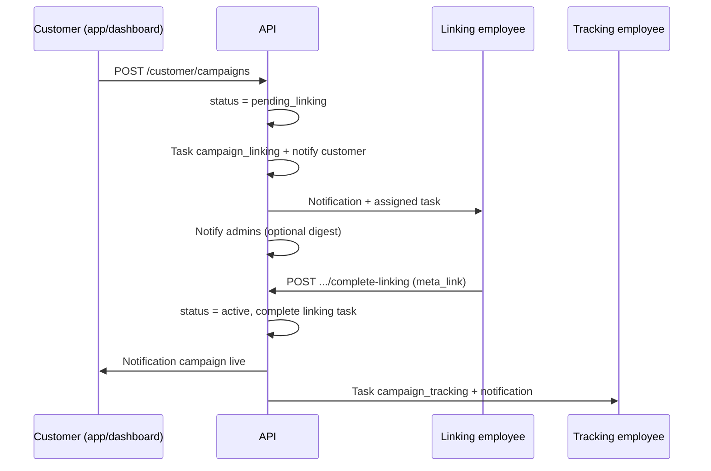
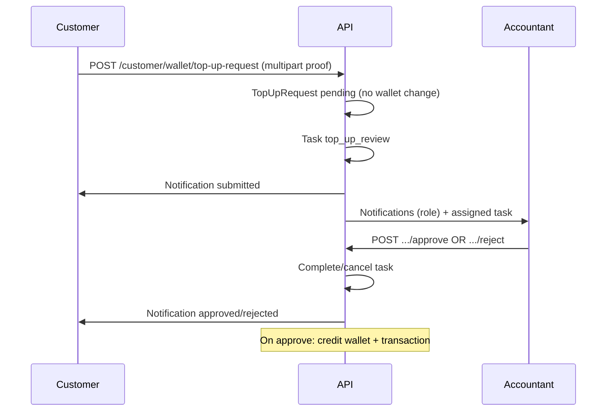

# Task & notification flows

## Customer creates a campaign

## Customer top-up with proof

## Low balance (customer)

- On `GET /customer/dashboard` and `GET /customer/wallet`, if balance ≤ `low_balance_threshold` setting and no `low_balance` notification in the last 24h → create notification.

## Super admin inactivity digest

- `POST /admin/system/notify-inactive` creates one in-app notification per super admin summarizing dormant customer count (does not email users unless you extend it).
