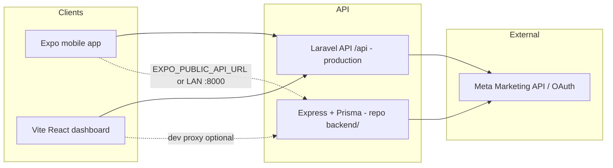

# Yalla Media — System report (mobile app + web dashboard)

This document describes **your Yalla Media ecosystem** as implemented in the current workspaces: the **customer-facing mobile app** (`Yalla_media_app`), the **operations / admin web dashboard** (`Yalla_Media_Dashboard`), and how they relate to the **backend API**. It is based on the repositories on disk (April 2026).

---

## 1. Executive summary

**Yalla Media** is a digital advertising operations product centered on **Meta (Facebook) ad accounts**, **campaigns**, **wallet / billing**, **receipts**, **tasks** (staff workflow), and **notifications**. Two first-party clients share one REST API under the `/api` prefix:

| Client | Stack | Primary users |
|--------|--------|----------------|
| **Mobile app** | Expo (React Native), React Navigation, i18n (EN/AR) | Customers (and same API roles as web where implemented) |
| **Web dashboard** | Vite, React 19, TypeScript, React Router | Super admins, admins, employees, accountants, customers (role-gated UI) |

**Canonical production API** (per project documentation) is the **Laravel** application exposed at `https://api.yallamedia.com/api`. The dashboard repository also contains a **Node.js + Express + Prisma (SQLite)** API under `backend/` that mirrors many concepts for local development or experimentation; the dashboard’s own docs treat Laravel `routes/api.php` as the **source of truth** for route semantics.

---

## 2. High-level architecture

**Web dev convenience:** `Yalla_Media_Dashboard/vite.config.ts` proxies `/api` to `http://127.0.0.1:8000`, matching the common local API port.

**Mobile dev convenience:** `src/api/client.js` resolves `BASE_URL` to:

- Production: `https://api.yallamedia.com/api` (unless overridden).
- Dev: Expo host IP + `:8000/api`, or `http://127.0.0.1:8000/api` when running the app on web localhost.
- Override: `EXPO_PUBLIC_API_URL` and optional `EXPO_PUBLIC_API_FORCE=1`.

---

## 3. Mobile application (`Yalla_media_app`)

### 3.1 Product identity

- **Expo app name:** Yalla Media (`app.json`: slug `yallamedia`).
- **Bundles:** `com.yallamedia.app` (iOS / Android).
- **EAS:** Project configured in `app.json` / `eas.json` (preview APK, production app bundle).
- **New Architecture:** Enabled (`newArchEnabled: true`).

### 3.2 Technical stack

- **Runtime:** Expo SDK ~54, React Native 0.81, React 19.
- **Navigation:** `@react-navigation` (stack + bottom tabs).
- **HTTP:** Axios with interceptors; Bearer token in `AsyncStorage` (`@yallamedia_token`).
- **UX:** `react-native-reanimated`, gesture handler, safe area, linear gradients, image picker, vector icons.
- **i18n:** `i18next` + `react-i18next` (resources in `src/i18n/`, default `lng: 'ar'` with `fallbackLng: 'en'`).
- **Theming:** `ThemeContext` + shared theme tokens; dark/light aligned with brand colors (e.g. deep purple base `#0F0A1A` in Expo config).

### 3.3 App composition (`App.js`)

Root providers (order matters):

1. `GestureHandlerRootView` + `SafeAreaProvider`
2. `LanguageProvider`
3. `ThemeProvider`
4. `AppProvider` (auth + user session)
5. `AppNavigator`

### 3.4 Navigation model

- **Unauthenticated:** Stack — Login, SignUp, OTPVerification (OTP handlers in context are currently stubbed to success).
- **Authenticated:** Stack containing:
  - **Main tabs:** Home, Campaigns, Balance, Profile (`BottomTabNavigator` with custom tab bar, RTL-aware).
  - **Modal-style flows:** TopUp, CreateCampaign, AdAccounts, CreateAccount, Bills, Notifications.

This mirrors the dashboard comment that mobile areas align with **Home, Campaigns, Balance, Ad accounts, Bills, Notifications, Profile**.

### 3.5 API modules (mobile `src/api/`)

| Module | Role |
|--------|------|
| `client.js` | Axios instance, token storage, base URL resolution |
| `auth.js` | Login, register, profile, password, FCM token, logout |
| `dashboard.js` | Home / dashboard aggregates (e.g. wallet, campaigns stats) |
| `campaigns.js`, `campaignTypes.js` | Campaign CRUD / types |
| `adAccounts.js` | Linked Meta ad accounts |
| `wallet.js` | Top-ups / wallet operations |
| `notifications.js` | Notification feed |

Auth payloads use Laravel-style naming where applicable (`password_confirmation`, `fcm_token`, etc.).

---

## 4. Web dashboard (`Yalla_Media_Dashboard`)

### 4.1 Technical stack

- **Build:** Vite 8, TypeScript, React 19, React Router 7.
- **HTTP:** Axios (`src/lib/api.ts`) — `VITE_API_URL` or default `/api` (proxied in dev).
- **Auth storage:** JWT in `localStorage` (see `src/lib/authToken.ts`).
- **UI:** Custom CSS (`index.css`), Lucide icons, Recharts for analytics-style pages, jsPDF for exports (`src/lib/reportExport.ts`).
- **i18n:** `src/i18n.ts` — English / Arabic with `dir` and `lang` on `<html>` (`App.tsx`).

### 4.2 Routes and role gates (`src/App.tsx`)

Public:

- `/login`, `/register`

Protected (require valid session via `AppContext`):

| Route | Page | Notes |
|-------|------|--------|
| `/dashboard` | Dashboard | Entry after login |
| `/users` | User management | `super_admin`, `admin` only |
| `/campaigns` | Campaign management | All authenticated roles in nav subset |
| `/ad-accounts` | Ad accounts | Customer + staff per `navByRole` |
| `/integrations` | Meta integrations | `super_admin`, `admin`, `customer` |
| `/integrations/meta-callback` | OAuth callback | Browser redirect handling |
| `/workspace` | Accountant workspace | `super_admin`, `admin`, `accountant` |
| `/billing` | Billing | Role-based nav |
| `/bills` | Bills | |
| `/tasks` | Tasks | Strong employee/accountant focus |
| `/campaign-types` | Campaign types | `super_admin`, `admin` |
| `/reports` | Reports | `super_admin`, `admin`, `accountant` |
| `/notifications` | Notifications | |
| `/settings` | Settings | |

Unmatched paths redirect to `/login`.

### 4.3 Shell and navigation (`src/layout/AppShell.tsx`)

- Sidebar grouped into **Overview**, **Operations**, **Finance**, **Insights**, **Administration**, **Account**.
- **Language** switcher (EN/AR), **theme** toggle (light/dark), **notifications** bell with unread indicator, **logout**.
- Visible items come from `navByRole` in `src/data/mockData.ts` (must stay aligned with product intent).

### 4.4 Application state (`src/context/AppContext.tsx`)

- **Real API:** Login, register, logout, `GET /auth/me`, notification list for unread count, `GET /tasks/stats` for task inbox badge (for roles that use tasks).
- **Still local / mock in context value:** `users`, `campaigns`, `receipts`, `notifications` arrays are wired to `mockData` for parts of the UI — so some screens may mix **live auth + inbox** with **demo datasets** until fully API-driven.

### 4.5 API documentation in repo

- `docs/api-status.md` — Classifies endpoints (preferred vs legacy duplicate vs internal redirect vs stub). States **canonical backend: Laravel** `routes/api.php`.
- `docs/meta-ads-api-readiness-audit.md` — Meta / marketing API readiness notes.
- `src/lib/internalEndpoints.ts` — Highlights browser-only flows (e.g. Meta OAuth callback, webhook).

---

## 5. Roles and permissions

Shared concept across types (`src/types.ts` in dashboard; Prisma `Role` enum in `backend/prisma/schema.prisma`):

| Role | Typical responsibility |
|------|-------------------------|
| `super_admin` | Full platform access |
| `admin` | Tenant / org administration |
| `employee` | Campaign/task execution |
| `accountant` | Billing, receipts, workspace, reports |
| `customer` | Own ad accounts, campaigns, wallet, bills |

Dashboard enforces routes with `RequireRole`. Mobile navigation is less granular (customer-oriented tabs) but the same API can distinguish roles for future staff apps.

---

## 6. Backend(s)

### 6.1 Production-shaped API (Laravel — documented, not in this workspace)

- Base: `https://api.yallamedia.com/api`.
- Responsibilities include: auth, role-specific dashboards (`GET /dashboard` preferred per docs), Meta OAuth (`/meta/auth-url`, `/meta/callback`), webhooks, sync jobs, reports, admin settings, accountant routes, etc.
- Dashboard UI expectations are tracked in `docs/api-status.md`.

### 6.2 Local reference API (`Yalla_Media_Dashboard/backend/`)

- **Stack:** Express 5, Prisma 6, SQLite (`DATABASE_URL`), JWT, bcrypt, multer, CORS.
- **Mounted at:** `/api` with routers: `auth`, `customer`, `notifications`, `campaign-types`, `meta`, `employee`, `accountant`, `admin`, `tasks`.
- **Domain model (Prisma):** `User`, `Wallet`, `Transaction`, `CampaignType`, `AdAccount`, `Campaign`, `Receipt`, `Notification`, `Task`, `Setting`, `EmployeeActivityLog` (see full `schema.prisma`).

Use this when you want an offline-first or portable demo of the same **domain language** as the product; **route parity** with Laravel should be verified per endpoint when integrating.

---

## 7. Cross-cutting concerns

### 7.1 Authentication

- **Web:** `POST /auth/login` with `platform: 'web'`; token stored in `localStorage`; `Authorization: Bearer` on requests; `401` clears token.
- **Mobile:** `POST /auth/login` with `platform` = `ios` | `android` | etc.; token in `AsyncStorage`; optional `fcm_token` for push.
- **Session check:** `GET /auth/me` on startup for both clients.

### 7.2 Internationalization

- Dashboard: EN/AR with RTL when `language === 'ar'`.
- Mobile: EN/AR via i18next; `LanguageContext` coordinates RTL layout (e.g. tab order reversal).

### 7.3 Theming

- Dashboard: `data-theme` on root + `localStorage` key `app-theme`.
- Mobile: `ThemeContext` with dark mode styling consistent with Expo splash/icon background.

### 7.4 Meta (Facebook) ads

- OAuth connect, ad account sync, campaign/insights sync, and reporting are first-class in the **API contract** (see `docs/api-status.md`). Both dashboard pages (`MetaIntegrationsPage`, `MetaOAuthCallbackPage`, etc.) and Prisma models (`AdAccount`, campaign fields like `metaLink`) reflect this.

---

## 8. Workspace: `Desktop\Yalla Media`

No `package.json` or tracked app source was found under this path in the scan used for this report. Treat it as **non-code** or **empty** unless you add a project there later.

---

## 9. Repository / deployment hints

| Artifact | Location / purpose |
|----------|---------------------|
| Mobile | `Yalla_media_app` — Expo / EAS builds |
| Dashboard SPA | `Yalla_Media_Dashboard` — `npm run dev` / `npm run build` |
| Local API | `Yalla_Media_Dashboard/backend` — `npm run dev` (port from `PORT` or 8000) |
| Postman | `Yalla_media_app` includes a Postman collection file (API exploration) |

---

## 10. Summary

You are running a **unified advertising operations platform** with:

1. A **React Native (Expo)** client optimized for **customers** (home, campaigns, balance, profile, plus linked flows for accounts, bills, top-up, notifications).
2. A **React (Vite) dashboard** for **staff and customers** with **fine-grained navigation by role**, Meta integration screens, finance and reporting areas, and bilingual UI.
3. A **REST API** whose **contract** is defined around **Laravel** in production (`api.yallamedia.com`), with an optional **Express + Prisma** implementation in the dashboard repo for local modeling and development.

Together, these pieces implement **wallet-funded, Meta-centric campaign management** with **tasks and notifications** for operational follow-through and **accountant** tooling for money movement and compliance-style views.

---

*Generated from repository structure and key source files. Update this file when architecture or canonical API ownership changes.*
